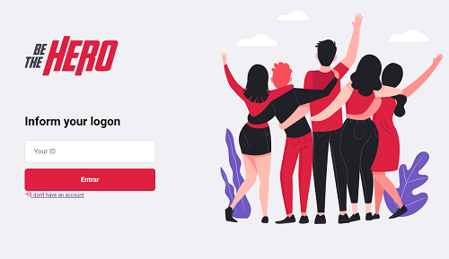
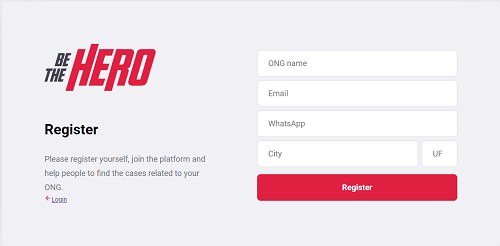
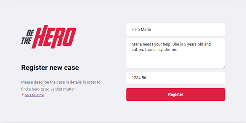
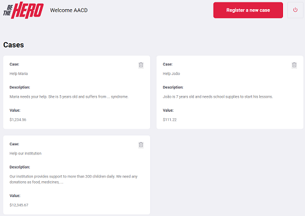

# Be the Hero

This is a study-case project built during OmniStack week by Rocketseat. 
The application intention is to help NGOs (Non-governmental organizations) in addressing cases through donations. 
There, you will find a list cases along with the description and the amount of money expected to address it.

## Getting Started

This application consists of two apps basically. 
    - The NGO web application which maintains the cases.
    - The mobile application where the users can make their donations.
    

        

    
      

    
      

    
      

### More details
For more details please refer to each folder project.
There you will find more information on how to run these projects in your local machine.

### Technologies
 - NodeJS
 - Express
 - ReactJS
 - React Native
